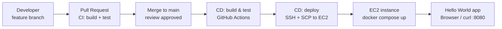

# Deployment Strategy

This document describes the deployment strategy used in this project in detail: the branching and
release model, the CI/CD concepts it relies on, the role of Docker and Docker Compose, and the
security trade-offs made along the way. For setup instructions and how to run the project, see
[README.md](README.md).

## Table of Contents

- [Overview](#overview)
- [Architecture](#architecture)
- [Why This Strategy](#why-this-strategy)
- [CI/CD Concepts Used](#cicd-concepts-used)
- [Role of Docker and Docker Compose](#role-of-docker-and-docker-compose)
- [Security Considerations and Trade-offs](#security-considerations-and-trade-offs)

## Overview

This project uses **trunk-based development with a protected `main` branch and push-triggered
continuous deployment** — the same pattern used for production services at most modern engineering
organizations, applied here to a minimal app so each stage of the pipeline can be demonstrated
clearly and verified in real time.

- All changes are made on short-lived feature branches and merged into `main` via pull request.
- A pull request triggers **CI** (build + test) before merge is allowed.
- A merge to `main` triggers **CD**: the application is built, validated, and deployed automatically
  to an AWS EC2 instance over SSH — no manual deploy step.
- Deployment uses a **recreate** strategy: the running container is stopped and replaced with the
  new one via Docker Compose. This is a deliberate, documented trade-off — a few seconds of downtime
  per deploy in exchange for a simple, fully automated, single-instance pipeline appropriate for
  this scale of service.

## Architecture

`main` is protected: no direct pushes, required passing CI checks, required review before merge.
The merge commit is what triggers the deploy stage — unreviewed branch code never reaches the
server.

## Why This Strategy

| Alternative | Why not chosen |
|---|---|
| Git Flow (develop/release/hotfix branches) | Overkill for a single small service with one deploy target; adds branch-management overhead with no real benefit here |
| Blue-green / rolling deployment | Requires a load balancer or multiple instances — out of scope for a single free-tier EC2 instance |
| Manual deployment (SSH + commands by hand) | Not reproducible, not auditable, defeats the purpose of CI/CD |
| Continuous delivery (manual deploy trigger) | A valid pattern, but full continuous *deployment* better demonstrates pipeline automation for this project |

## CI/CD Concepts Used

- **Continuous Integration (CI):** every change is automatically built and validated (build the
  Docker image, run it, assert the expected HTTP response) before being allowed into `main`.
- **Continuous Deployment (CD):** every change that lands on `main` is automatically shipped to the
  live environment, with no manual "deploy" click — distinct from *continuous delivery*, where a
  human still approves the release.
- **Pipeline stages/jobs:** the workflow is split into `build` and `deploy` jobs with a `needs`
  dependency, so deployment never runs against unverified code.
- **Managed runner:** this project uses GitHub's hosted `ubuntu-latest` runners rather than a
  self-hosted runner — sufficient for this workload and removes the operational burden of
  maintaining runner infrastructure.
- **Secrets management:** SSH credentials and the server address are injected at runtime from
  GitHub's encrypted secret store, never committed to source.
- **Idempotent deployment:** `docker compose down || true` followed by `docker compose up -d
  --build` produces the same end state regardless of how many times it's re-run, which is what
  makes "just re-run the pipeline" a safe recovery action.
- **Event-triggered execution:** the pipeline runs in response to a `push` to `main`, tying
  deployment directly to the branch protection and review process rather than running on a
  schedule or by manual trigger.

## Role of Docker and Docker Compose

**Docker** packages the application with its exact runtime and dependencies into a single portable
image, so the same artifact behaves identically in local testing, in CI, and on the EC2 host — no
"works on my machine" gap, and no manually installing Python/pip on the server.

**Docker Compose** defines *how* the container should run — image source, port mapping, environment
variables, restart policy — as a single checked-in, version-controlled file rather than a
remembered `docker run` command. It is also what the CD pipeline directly executes
(`docker compose up -d --build`), which is exactly how this same mechanism would scale to multiple
services (app + reverse proxy + database) without changing the deployment approach.

No `volumes` are defined: the application is fully stateless with no persistent data to mount. This
is a deliberate decision, not an oversight.

## Security Considerations and Trade-offs

- **SSH open to `0.0.0.0/0`:** required because GitHub-hosted runners use dynamic IPs with no fixed
  range that can be safely allow-listed long-term. Mitigated by key-only authentication (password
  auth is disabled by default on the Ubuntu AMI). A tighter alternative is restricting the rule to
  GitHub's published Actions runner IP ranges, at the cost of needing to keep that list updated.
- **No TLS/HTTPS:** acceptable for a non-sensitive demo; a real deployment would sit behind a
  reverse proxy (nginx/Caddy) with a Let's Encrypt certificate.
- **Single instance, no staging environment:** every merge to `main` deploys straight to the only
  environment that exists. A production setup would add a staging environment and/or a manual
  approval gate (e.g., GitHub Environments with required reviewers) between merge and production
  deploy.
- **Image rebuilt on the server rather than pulled from a registry:** simpler to set up and
  requires no registry credentials, but means the exact image validated in the `build` job isn't
  guaranteed to be byte-identical to what `docker compose up --build` produces on the server. A
  stricter pipeline would build once, push a SHA-tagged image to a registry, and have the deploy
  stage pull that exact artifact rather than rebuilding.
- **Secrets:** SSH private key and server address are stored exclusively in GitHub Actions secrets,
  scoped to this repository, and never appear in logs or source.
